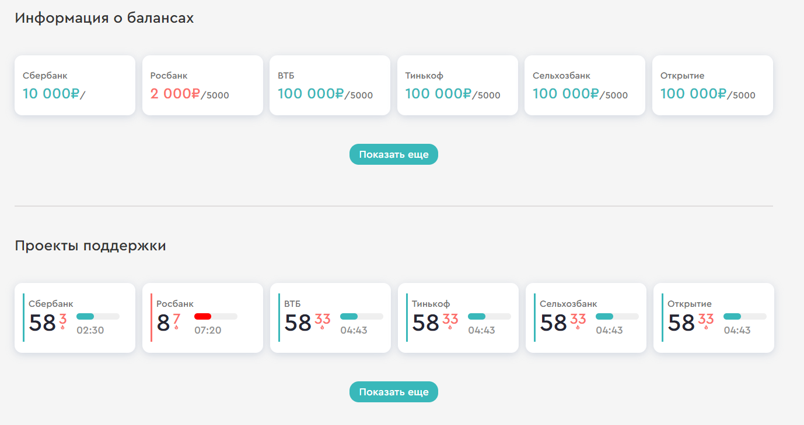
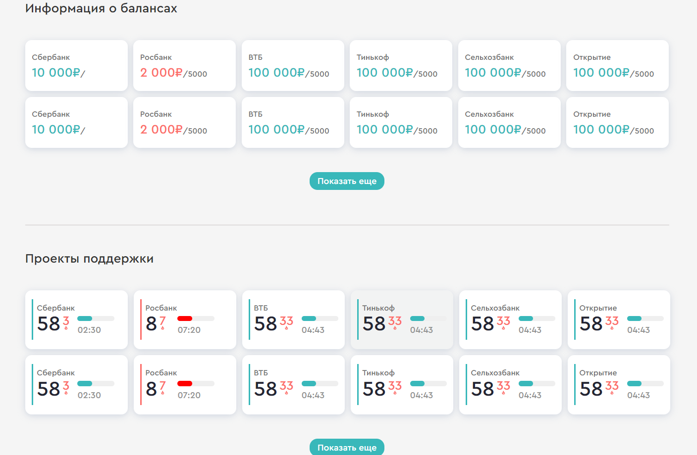

# reload-test
В данном тестовом задании необходимо из JSON массива было взять переменные и отобразить их в карточках. 
тестовое сделан Vue третей версии. Также прописать услвовия для обоих типов карточек. При котором карточки окрашиваются в красный цвет
Также, если нажать на кнопку "Показать еще", то добавляются еще 6 карточек. 



## Project setup
```
npm install
```

### Compiles and hot-reloads for development
```
npm run serve
```

### Compiles and minifies for production
```
npm run build
```

### Lints and fixes files
```
npm run lint
```

### Customize configuration
See [Configuration Reference](https://cli.vuejs.org/config/).
